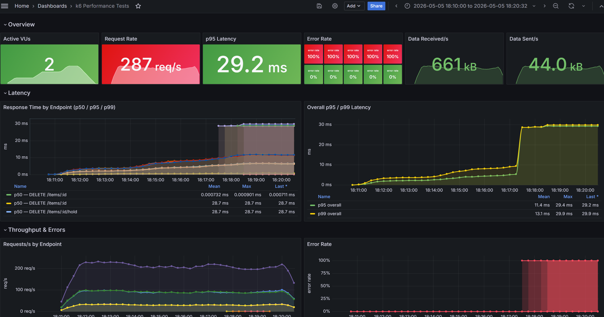

# Performance Testing

Load, smoke, and stress tests using [k6](https://grafana.com/docs/k6/latest/). Results stream to Prometheus via Remote Write and are visualised in a dedicated Grafana dashboard alongside application metrics.

## Architecture

```
k6 (VUs executing JS scripts)
  │
  │  HTTP/1.1 requests
  ▼
FastAPI backend  ──►  PostgreSQL
  │
  │  Prometheus Remote Write (every 5 s)
  ▼
Prometheus (:9090)
  │
  ▼
Grafana (:3001)  →  "k6 Performance Tests" dashboard
```

k6 runs entirely on the host machine. Each Virtual User (VU) executes the test script in a separate goroutine, sharing no state. Metrics are batched and pushed to Prometheus every 5 seconds using the `experimental-prometheus-rw` output extension.

## Core Concepts

### Virtual Users (VUs)
A VU is a simulated user that continuously executes the `default` function in a tight loop. Each iteration is one request (or a short sequence of requests). More VUs = more concurrent load.

### Stages
Stages define how the VU count changes over time:

```js
stages: [
  { duration: "1m", target: 100 },  // ramp up to 100 VUs over 1 min
  { duration: "3m", target: 100 },  // hold 100 VUs for 3 min
  { duration: "1m", target: 0   },  // ramp down (graceful teardown)
]
```

### Thresholds
Pass/fail criteria evaluated at the end of the run. k6 exits non-zero if any threshold is breached:

```js
thresholds: {
  http_req_failed:   ["rate<0.02"],    // < 2% error rate
  http_req_duration: ["p(95)<1000"],   // p95 latency < 1 s
}
```

### Traffic mix
The `default` function uses `Math.random()` to distribute load across scenarios:

| Scenario | Weight | Endpoints |
|----------|--------|-----------|
| Browse | 60% | `GET /items`, `GET /items/:id` |
| Create listing | 30% | `POST /items` |
| Purchase hold | 10% | `POST /items/:id/hold`, `POST /items/:id/confirm` |

### Metrics pushed to Prometheus
All metrics carry a `name` label matching the endpoint tag (e.g. `GET /items`).

| Metric | Type | Description |
|--------|------|-------------|
| `k6_http_req_duration_p(50/95/99)` | Gauge | Latency percentiles per endpoint |
| `k6_http_reqs_total` | Counter | Total requests |
| `k6_http_req_failed_rate` | Gauge | Error rate (0–1) |
| `k6_vus` | Gauge | Active virtual users |
| `k6_iterations_total` | Counter | Completed script iterations |
| `k6_data_sent_bytes` / `k6_data_received_bytes` | Counter | Bandwidth |

## Prerequisites

Install k6 on Ubuntu/WSL2 (run each command separately):

```bash
sudo apt-get install -y gnupg
curl -fsSL https://dl.k6.io/key.gpg | sudo gpg --dearmor -o /usr/share/keyrings/k6-archive-keyring.gpg
echo "deb [signed-by=/usr/share/keyrings/k6-archive-keyring.gpg] https://dl.k6.io/deb stable main" | sudo tee /etc/apt/sources.list.d/k6.list
sudo apt-get update
sudo apt-get install -y k6
k6 version
```

All services must be running before executing any test:

```bash
make db-up        # PostgreSQL on :5432
make obs-up       # Prometheus on :9090, Grafana on :3001
make backend-run  # FastAPI on :8000
```

## Running Tests

```bash
make perf-smoke    # 1 VU, 1 min — sanity check, all endpoints
make perf-load     # 20 VUs, ~5 min — normal expected traffic
make perf-stress   # 500 → 1500 VUs, ~10 min — find the breaking point
```

Results appear in Grafana at **http://localhost:3001** → "k6 Performance Tests" within seconds of the test starting.

## Test Scenarios

| Script | VUs | Duration | Purpose |
|--------|-----|----------|---------|
| `smoke.js` | 1 | 1 m | Verifies all endpoints respond correctly under negligible load |
| `load.js` | 20 | ~5 m | Simulates normal traffic with realistic endpoint mix |
| `stress.js` | 500 → 1 500 | ~10 m | Pushes far beyond normal load to find the breaking point |

## Thresholds

| Test | Metric | Threshold |
|------|--------|-----------|
| smoke | error rate | < 1% |
| smoke | p95 latency | < 500 ms |
| load | error rate | < 2% |
| load | p95 latency | < 1 s |
| stress | error rate | < 10% |
| stress | p95 latency | < 3 s |

k6 exits with a non-zero code if any threshold is breached, making it CI-friendly.

## Grafana Dashboard

Open **http://localhost:3001** → Dashboards → "k6 Performance Tests".



The dashboard is auto-provisioned from `observability/grafana/dashboards/k6-performance.json`. It refreshes every 30 seconds and shows the last hour by default.

### Panels

**Overview row** — live snapshot while the test runs:
- Active VUs, Request Rate (req/s), p95 Latency, Error Rate, Data Received/s, Data Sent/s

**Latency row:**
- *Response Time by Endpoint* — p50/p95/p99 time series per tagged endpoint
- *Overall p95/p99 Latency* — aggregate latency trend for the full run

**Throughput & Errors row:**
- *Requests/s by Endpoint* — per-endpoint throughput over time
- *Error Rate* — proportion of failed requests over time

## Custom BASE_URL

```bash
BASE_URL=http://staging.example.com make perf-load
```
